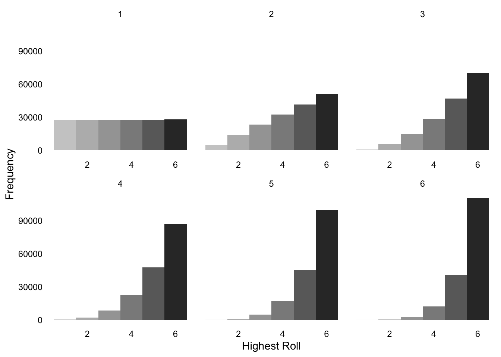
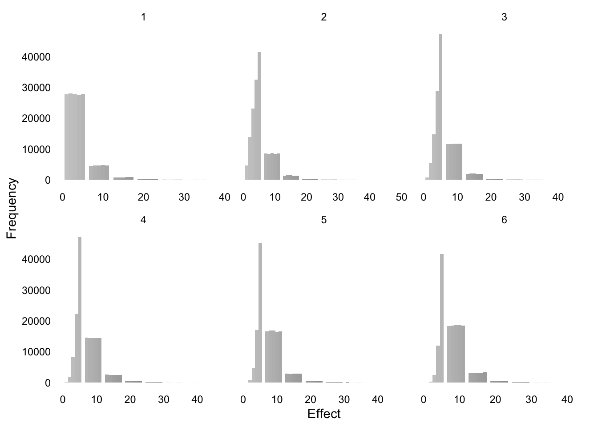
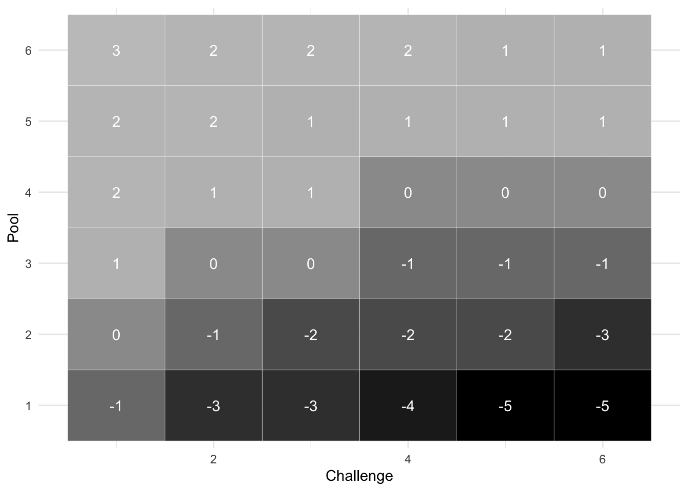
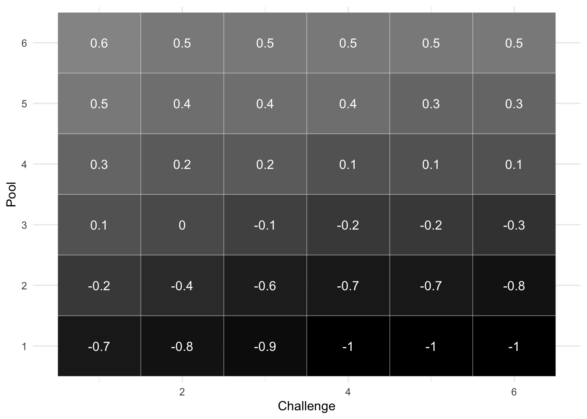

# Simulations

This section details some simulation results from the game mechanics.
It is not a required read, but should support understanding the design choices and their stochastic impacts.

## Chances

Chances are rolled with a number of 6-sided dice (a dice pool).
Because of the **Dark Dice** the dice pool size starts at $\mathbf{1}$ and has no upper limit.

The function below simulates the roll of a dice pool.


```r
# Vectorized version of roll_highest
roll_highest_vec <- function(num_dice_vector) {
  # Use sapply to apply the rolling logic to each element of num_dice_vector
  sapply(num_dice_vector, function(num_dice) {
    max(sample(1:6, num_dice, replace = TRUE))
  })
}
```

I apply the function to a data frame in a Monte Carlo fashion, with dice pool sizes from 1 to 8.
The plot show the distribution of results for different dice pool sizes.


```r
# Create a sample dataframe
df <- data.frame(pool = sample(1:6, runs, TRUE)) %>%
  mutate(result = roll_highest_vec(pool))

ggplot(df, aes(x = result)) +
  geom_histogram(binwidth = 1, aes(fill = as.factor(result))) +
  scale_fill_grey(start = 0.8, end = 0.2) + # Use grey scale for the fill
  facet_wrap(~pool, scales = "free_x") + # Facet by pool, allowing each facet to scale x independently
  theme_minimal() + # Use a minimalist theme
  theme(
    strip.background = element_blank(),
    legend.position = 'none',
    strip.text = element_text(colour = "black"),
    panel.grid.major = element_blank(),
    panel.grid.minor = element_blank(),
    axis.text = element_text(color = "black"),
    axis.title = element_text(color = "black")
  ) +
  labs(x = "Highest Roll", y = "Frequency") # Label axes
```



Now I apply the result grouping (1:3, 4:5 or 6) and qualify them into full success (1), success and complications (0) and only complications (-1).


```r
# Qualify results
df <- df %>%
  mutate(success = ifelse(result <= 3, -1, ifelse(result <= 5, 0, 1)))

ggplot(df, aes(x = success)) +
  geom_histogram(binwidth = 1, aes(fill = as.factor(success))) +
  scale_fill_grey(start = 0.8, end = 0.2) + # Use grey scale for the fill
  facet_wrap(~pool, scales = "free_x") + # Facet by pool, allowing each facet to scale x independently
  theme_minimal() + # Use a minimalist theme
  theme(
    strip.background = element_blank(),
    legend.position = 'none',
    strip.text = element_text(colour = "black"),
    panel.grid.major = element_blank(),
    panel.grid.minor = element_blank(),
    axis.text = element_text(color = "black"),
    axis.title = element_text(color = "black")
  ) +
  labs(x = "Highest Roll", y = "Frequency") # Label axes
```


Now define the **Effect** roll function, that takes in consideration exploding dice.


```r
# Exploding die
explode_die <- function() {
  total = 0
  repeat {
    # Roll the die
    roll = sample(1:6, 1, replace = TRUE)
    # Add the roll to the total
    total = total + roll
    # Break the loop if the roll is not six
    if (roll != 6) {
      break
    }
  }
  # Return the accumulated total
  return(total)
}

# Effect roll, considering exploding die
effect_roll <- function(num_dice_vector) {
  # Use sapply to apply the rolling logic to each element of num_dice_vector
  sapply(num_dice_vector, function(num_dice) {
    highest_die <- max(sample(1:6, num_dice, replace = TRUE))
    if (highest_die == 6) {
      effect <- highest_die + explode_die()
    } else {
      effect <- highest_die
    }
  })
}
```

Now plot the difference in Effect, by different Effect dice pools.


```r
# Create a sample dataframe
eff <- data.frame(pool = sample(1:6, runs, TRUE)) %>%
  mutate(effect = effect_roll(pool))

ggplot(eff, aes(x = effect)) +
  geom_histogram(binwidth = 1, aes(fill = as.factor(effect))) +
  scale_fill_grey(start = 0.8, end = 0.2) + # Use grey scale for the fill
  facet_wrap(~pool, scales = "free_x") + # Facet by pool, allowing each facet to scale x independently
  theme_minimal() + # Use a minimalist theme
  theme(
    strip.background = element_blank(),
    legend.position = 'none',
    strip.text = element_text(colour = "black"),
    panel.grid.major = element_blank(),
    panel.grid.minor = element_blank(),
    axis.text = element_text(color = "black"),
    axis.title = element_text(color = "black")
  ) +
  labs(x = "Effect", y = "Frequency") # Label axes
```



Now I add the **Effects** of both sides.
Player **Effects** are added as $\mathbf{1d}$, while **Challenge Effects** are added randomly between $\mathbf{1d}$ and $\mathbf{4d}$.

The plot shows the average net effect between player and challenge, for different combination of dice pools.


```r
# Augment the df
df <- df %>%
  mutate(challenge = sample(1:6, runs, TRUE),
         pcEff = ifelse(success >= 0, effect_roll(rep(1, runs)), 0),
         chEff = ifelse(success <= 0, effect_roll(challenge), 0),
         ntEff = pcEff - chEff)

df %>% group_by(pool, challenge) %>%
  summarise(ntEffU = round(mean(ntEff))) %>%
  ungroup() %>% 
  ggplot(aes(x = challenge, y = as.factor(pool), fill = ntEffU)) +
  geom_tile(color = "white") + # Add tiles with white borders
  geom_text(aes(label = ntEffU), color = "white") + # Add ntEffU values as text
  scale_fill_gradient2(low = "black", high = "lightgray", mid = "gray", midpoint = median(df$ntEff)) +
  theme_minimal() + # Use a minimalist theme
  theme(
    legend.position = "none" # Hide the legend
  ) +
  labs(x = "Challenge", y = "Pool") # Label axes
```

```
## `summarise()` has grouped output by 'pool'. You can override using the
## `.groups` argument.
```



Now I convert a challenge to a single Chance Roll, by making an effect roll before and applying the result of that as a modifier to player chance dice pool.


```r
# Augment the df
df <- df %>%
  mutate(chEff1st = effect_roll(challenge),
         complication = case_when(chEff1st <= 3 ~ 0,
                                  chEff1st <= 5 ~ 1,
                                  chEff1st <= 11 ~ 2,
                                  chEff1st <= 17 ~ 3,
                                  TRUE ~ 4),
         newPool = pmax(1, pool - complication),
         result1st = roll_highest_vec(newPool),
         success1st = ifelse(pool - complication <= 0, -1,
                             ifelse(result1st <= 3, -1,
                                    ifelse(result1st <= 5, 0, 1))))

df %>% group_by(pool, challenge) %>%
  summarise(simplCh = sum(success1st),
            succPerc = round(simplCh / n(), 1)) %>%
  ungroup() %>%
  ggplot(aes(x = challenge, y = as.factor(pool), fill = succPerc)) +
  geom_tile(color = "white") + # Add tiles with white borders
  geom_text(aes(label = succPerc), color = "white") + # Add ntEffU values as text
  scale_fill_gradient2(low = "black", high = "lightgray", mid = "gray", midpoint = median(df$ntEff)) +
  theme_minimal() + # Use a minimalist theme
  theme(
    legend.position = "none" # Hide the legend
  ) +
  labs(x = "Challenge", y = "Pool") # Label axes
```

```
## `summarise()` has grouped output by 'pool'. You can override using the
## `.groups` argument.
```


